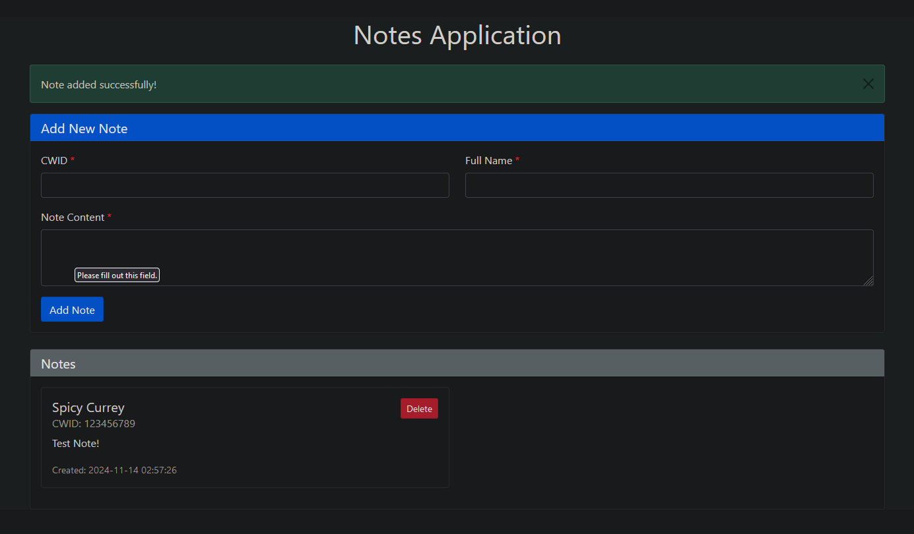

# Notes Application

A Flask-based web application that allows users to create, view, and delete notes using MongoDB as the database backend.

## Features

- Create notes with CWID and full name
- View all notes in a responsive grid layout
- Delete notes
- Input validation
- Responsive design
- Flash messages for user feedback
- MongoDB integration

## Example Usage




## Prerequisites

- Python 3.8+
- MongoDB (local installation or MongoDB Atlas account)
- pip (Python package manager)

## Installation

1. Clone the repository:

    ```bash
    git clone https://github.com/spicy/mongo-notes-flask-app
    cd mongo-notes-flask-app
    ```

2. Create and activate a virtual environment:

    ```bash
    python -m venv venv
    venv\Scripts\activate
    ```

3. Install required packages:

    ```bash
    pip install -r requirements.txt
    ```

4. Create a `.env` file in the project root:

    ```plaintext
    MONGODB_URI=mongodb://localhost:27017/mongo-notes-flask-app
    SECRET_KEY=your-secure-secret-key-here
    FLASK_DEBUG=False
    ```

## Configuration

### MongoDB Setup

1. Local MongoDB:
   - Install MongoDB on your system
   - Start the MongoDB service
   - Use the default connection string: `mongodb://localhost:27017/mongo-notes-flask-app`

2. MongoDB Atlas:
   - Create a MongoDB Atlas account
   - Create a new cluster
   - Get your connection string
   - Replace the MONGODB_URI in `.env` with your Atlas connection string

### Environment Variables

- `MONGODB_URI`: MongoDB connection string
- `SECRET_KEY`: Secret key for Flask sessions
- `FLASK_DEBUG`: Set to "True" for development, "False" for production

## Project Structure

```bash
mongo-notes-flask-app/
├── app.py # Main Flask application
├── templates/ # HTML templates
│ └── home.html # Main template file
├── .env # Environment variables
├── requirements.txt # Project dependencies
└── README.md # Project documentation
```

## Running the Application

1. Ensure MongoDB is running (if using local installation)

2. Start the Flask application:

    ```bash
    python app.py
    ```

3. Access the application at `http://localhost:5000`

## Usage

### Adding a Note

1. Fill in the required fields:
   - CWID (8 digits)
   - Full Name
   - Note Content
2. Click "Add Note"


### Viewing Notes

- All notes are displayed on the homepage
- Notes are sorted by creation date (newest first)

### Deleting a Note

1. Find the note you want to delete
2. Click the "Delete" button
3. Confirm the deletions


## Input Validation

- CWID must be 9 digits
- All fields are required
- Input is sanitized before storage

## API Endpoints

### GET /api/notes

Returns all notes in JSON format

Response format:

```json
{
    "notes": [
        {
            "id": "note_id",
            "cwid": "123456789",
            "full_name": "John Doe",
            "content": "Note content",
            "created_at": "timestamp",
            "updated_at": "timestamp"
        }
    ]
}
```

## Error Handling

- Invalid input validation
- Database connection errors
- Note not found errors
- Server errors

## Security Features

- Input validation and sanitization
- CSRF protection
- Secure session handling
- Environment variable configuration

## Development

### Running in Debug Mode

Set `FLASK_DEBUG=True` in `.env` file
